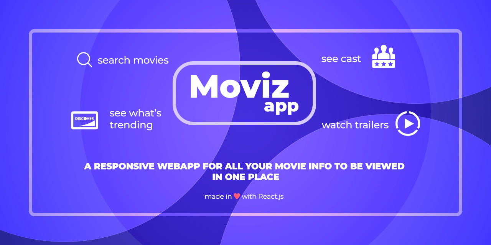
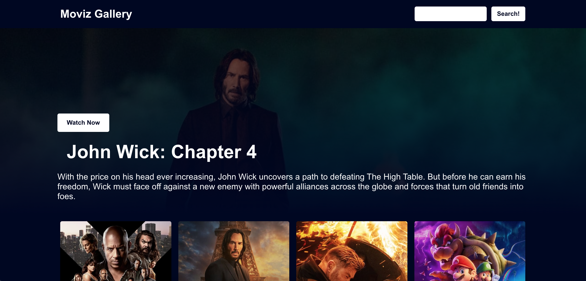
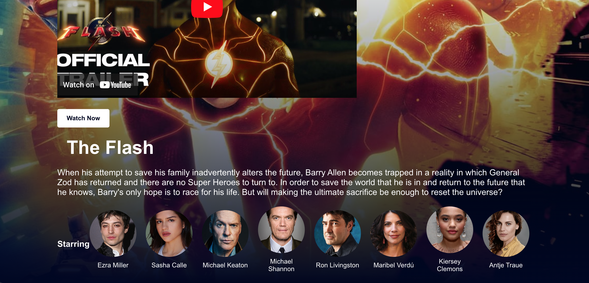

# Moviz App

 

Hello Everyone 👋,

This is my first project on github (Apart from the portfolio, if that counts 😅)

* Moviz app is made using React.js and HTML languages.
* Movie Data is fetched using TheMovieDataBase API.
* Trailers are fetched using Youtube and displayed using react youtube player.

> You can preview the app by clicking [Here](https://chamal1120.github.io/Movizapp/ "Go to Moviz app Preview ")

Here are couple of screenshots,

  

 Credits to ❤️,
 * [The Movie Database for the API](https://www.themoviedb.org/)
 * [ChatGPT for asnwering my tiresome questions](https://chat.openai.com/)

